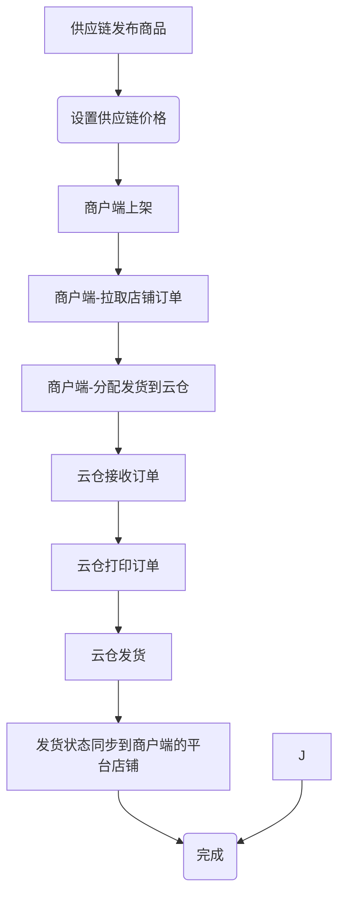

# 启航电商ERP-SCM供应链云仓发货版

## 一、项目概述

启航电商ERP-SCM供应链云仓发货版是为电商供应链端开发的一套云仓发货订单处理系统，主体功能是商户从各电商平台店铺拉取订单、供应链端在系统处理订单发货业务。系统分为供应链端和商户端，供应链端主要功能：商品发布、订单打印、订单发货、售后处理等功能。商户端功能有：店铺管理、订单同步、订单分发到云仓、售后管理、商品上下架等。本系统后端采用SpringBoot3+Vue2+Element开发。

#### 供应链端主要功能：
  + 商品发布、价格设置
  + 订单打印
  + 订单发货
  + 售后处理
  + 商户管理

#### `商户端`主要功能有：
  + 店铺管理
  + 店铺订单同步、
  + 订单分发给供应商
  + 店铺售后管理
  + 店铺商品上下架管理

**系统主干流程：**

## 二、技术说明

### 2.1 主要版本
+ 后端：
  + `Java`: 17
  + `SpringBoot`: 3.0.13

+ 前端：
  + `vue2`
  + `elementUI`

### 2.2 存储及中间件
+ `MySQL`:数据库,版本8.x。
+ `minio文`:文件存储,用于图片存储。
+ `Redis`:在线用户信息、缓存。
+ `Nacos`:版本2.3.0以上，配置中心、注册中心。

### 2.3 项目结构
#### 2.3.1 oms-api
`供应链端`接口项目，端口8080

#### 2.3.2 mms-api
`商户端`接口项目，端口8081

#### 2.3.3 model
微服务接口类库（包括domain、service-interface）

#### 2.3.4 service
微服务实现层，service-impl

#### 2.3.5 common
公共类库

#### 2.3.6 vue-oms
`供应链端`前端Vue项目，调用`oms-api`项目接口

#### 2.3.7 vue-mms
`商户端`前端Vue项目，调用`mms-api`项目接口

## 三、如何使用？
### 3.1、开发环境配置
+ MySQL数据库创建
  + 运行MySQL脚本`docs\sql\qihangerp-scm.sql`导入数据到主库`qihangerp-scm`

+ 启动nacos
  + 启动
  
    **一般情况下：下载nacos2.3.2解压之后直接运行：**
  
    `startup.cmd -m standalone`
 
  + 添加Nacos配置
    + 项目dataId`qihangerp-scm.yaml`（配置内容从docs\qihangerp-scm.yaml复制即可）

+ 启动Redis

  
+ 启动minio

  
### 3.2、启动后端

+ 启动`api-scm`项目
+ 启动`api-dcm`项目

### 3.3、启动前端 `vue-scm`、`vue-dcm`
+ `npm install`
+ `npm run dev`
+ 打包`npm run build:prod`
+ 访问web
  + 访问地址：`http://localhost`
  + 登录名：`admin`
  + 登录密码：`admin123`

## 四、支持作者

**感谢大家的关注与支持！希望利用本人从事电商10余年的经验帮助到大家提升工作效率！**

💖 如果觉得有用记得点 Star⭐

### 1、有偿服务
+ 提供部署服务
+ 提供演示包服务
+ 提供定制化开发服务
+ 提供系统培训服务
+ 提供版本商业化支持服务
+ 提供电商系统软著代申请服务（文档、源代码）
+ 提供电商平台appkey申请协助服务

### 2、更多服务

更多服务，请关注作者微信公众号：qihangerp168

💖 欢迎一起交流！

### 3、捐助支持
作者为兼职做开源,平时还需要工作,如果帮到了您可以请作者吃个盒饭

