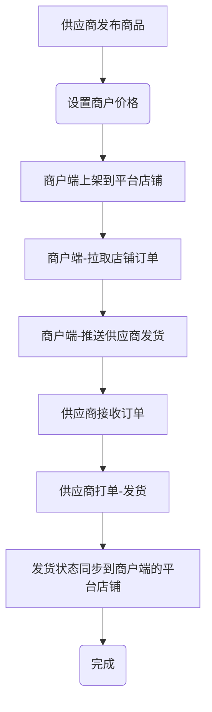

# 启航电商供应链管理系统

## 一、项目概述

**该系统处于开发初期。。。欢迎一起交流。。。请关注我！**

启航电商供应链管理系统是为供应链电商业务开发的一套支持多商户多供应商的订单处理系统，主体功能分2个大块，
+ 一：商户独立管理各电商平台店铺订单，支持多平台多店铺统一管理。支持自己手动发货、自己电子面单打单发货，支持分配给供应商发货；
+ 二、供应商端处理订单发货、库存管理、电子面单打印等。

本系统后端采用SpringBoot3+Vue2+Element开发。

**目前仅支持拼多多，后续会继续支持更多电商平台**

### 系统由3个子系统组成
#### `供应链总后台`
总后台主要是管理功能，包括：管理商品、管理供应商、管理商品等；

#### `供应商端`
供应商端主要是管理自己的商品以及商户推送过来的订单处理。主要功能包括：
  + 商品发布、价格设置
  + 商户订单发货（支持手动发货、电子面单打单发货）
  + 商户售后处理
  + 商户管理
  + 商品库存管理

#### `商户端`主要功能有：
商户后台包含了一个完整的电商ERP系统，主要功能包括：
  + 平台店铺管理（支持多平台多店铺统一管理）
  + 平台店铺订单管理
  + 订单推送到供应商发货
  + 订单自己发货（支持手动发货、电子面单打单发货）
  + 电子面单管理（支持共享电子面单给供应商）
  + 平台店铺售后管理
  + 店铺商品上下架管理

**系统主干流程：**

## 二、技术说明

### 2.1 主要版本
+ 后端：
  + `Java`: 17
  + `SpringBoot`: 3.0.13

+ 前端：
  + `vue2`
  + `elementUI`

### 2.2 存储及中间件
+ `MySQL`:数据库,版本8.x。
+ `minio文`:文件存储,用于图片存储。
+ `Redis`:在线用户信息、缓存。
+ `Nacos`:版本2.3.0以上，配置中心、注册中心。

### 2.3 项目结构
#### 后端项目结构
##### 2.3.1 gateway
`网关`项目，端口8089

##### 2.3.2 oms-api
主要包含了订单处理相关接口，通过gateway转发访问

##### 2.3.3 mms-api
主要包含了商户相关接口，通过gateway转发访问

##### 2.3.4 vms-api
主要包含了供应商相关接口，通过gateway转发访问

##### 2.3.5 model
微服务接口类库（包括domain、service-interface）

##### 2.3.6 service
微服务实现层，service-impl

##### 2.3.7 common
公共类库

#### 前端项目结构
#### 2.3.8 vue-oms
`总后台`前端Vue项目，总后台主要是管理功能，包括：管理商品、管理供应商、管理商品等；

#### 2.3.9 vue-mms
`商户端`前端Vue项目，商户店铺、商品、订单、售后等处理。

#### 2.3.10 vue-vms
`供应商端`前端Vue项目，商品、商户订单处理、商户售后处理等

## 三、如何使用？
### 3.1、开发环境配置
#### 3.1.1 导入数据库
+ 创建MySql数据库：`qihangerp-scm`
+ 导入数据库`docs\sql\qihangerp-scm.sql`

#### 3.1.2 配置Nacos
+ 启动nacos
  + 启动
    **一般情况下：下载nacos2.3.2解压之后直接运行：**
    `startup.cmd -m standalone`

#### 3.1.3 启动Redis

**不会的百度一下**

#### 3.1.4 启动minio

**图片服务器，不会的百度一下**

  
### 3.2、启动后端

+ 启动`api`下所有微服务项目

### 3.3、启动前端 `vue-oms`、`vue-mms`、`vue-vms`
+ `npm install`
+ `npm run dev`
+ 打包`npm run build:prod`
+ 访问web
  + 访问地址：`http://localhost`
  + 登录名：`admin`
  + 登录密码：`admin123`

## 四、支持作者

**感谢大家的关注与支持！希望利用本人从事电商10余年的经验帮助到大家提升工作效率！**

💖 如果觉得有用记得点 Star⭐

### 1、有偿服务
+ 提供部署服务
+ 提供定制化开发服务
+ 提供商业版本售卖
+ 围绕电商ERP系统的其他商业服务

### 2、一起交流

一起交流，请关注作者微信公众号：qihangerpcn

💖 欢迎一起交流！

### 3、捐助支持
作者为兼职做开源,平时还需要工作,如果帮到了您可以请作者吃个盒饭

