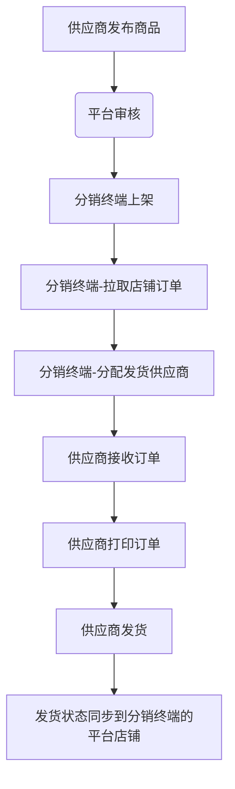

# 启航电商SCM供应链分销代发系统

## 一、项目概述

启航电商SCM供应链分销代发系统是为电商供应链端开发的一套代发业务系统，主体功能是分销渠道从各平台拉取订单、厂家(供应商)直接从系统发货。系统分为厂家(供应商)端和分销渠道端两个终端，厂家端主要功能：商品发布、订单打印、订单发货、售后处理等功能。渠道端功能有：店铺管理、订单同步、订单分发给供应商、售后管理、商品上下架等。本系统后端采用SpringBoot3，前端采用Vue2+Element开发。

系统使用者有：平台管理者、厂家(供应商)、分销终端(各店铺经营者)。

**系统主干流程：**




## 二、项目说明
**本项目后端采用Dubbo微服务开发，前端采用vue+element开发**
### 2.1 主要版本
+ 后端：
  + `Java`: 17
  + `SpringBoot`: 3.0.13
  + `Dubbo`：3.2.11
+ 前端：
  + `vue2`
  + `elementUI`

### 2.2 存储及中间件
+ `MySQL`:数据库,版本8.x。
+ `minio文`:文件存储,用于图片存储。
+ `Redis`:在线用户信息、缓存。
+ `Nacos`:版本2.2.0以上，配置中心、注册中心。

### 2.3 项目结构
#### 2.3.1 api-scm
供应商分销代发后端接口服务，端口8080，采用dubbo调用其他微服务。

#### 2.3.2 api-dcm
分销终端后端接口服务，端口8080，采用dubbo调用其他微服务。

#### 2.3.3 interfaces
微服务接口类库（包括domain、service-interface）

#### 2.3.4 service
微服务实现层，service-impl

#### 2.3.5 common
公共类库

#### 2.3.6 vue-scm
供应商分销代发系统前端Vue项目

#### 2.3.7 vue-dcm
分销终端管理系统前端Vue项目

## 三、如何使用？
### 3.1、开发环境配置
+ MySQL数据库创建
  + 运行MySQL脚本`docs\sql\qihangerp-scm.sql`导入数据到主库`qihangerp-scm`

  + 运行MySQL脚本`docs\sql\nacos.sql`导入数据到nacos库`nacos`


+ 启动nacos
  + 修改Nacos数据库配置 `nacos\conf\application.properties`
  ```
  db.url.0=jdbc:mysql://127.0.0.1:3306/nacos?characterEncoding=utf8&connectTimeout=1000&socketTimeout=3000&autoReconnect=true&useUnicode=true&useSSL=false&serverTimezone=Asia/Shanghai
  db.user.0=root
  db.password.0=Andy_123
  ```

  + 启动Nacos
  + 添加Nacos配置
    + 项目dataId`qihangerp-scm.yaml`（配置内容从docs\qihangerp-scm.yaml复制即可）
+ 启动Redis

  
+ 启动minio


  
### 3.2、启动后端

+ 启动`service`下面的所有微服务
+ 启动`api-scm`项目
+ 启动`api-dcm`项目

### 3.3、启动前端 `vue-scm`、`vue-dcm`
+ `npm install`
+ `npm run dev`
+ 打包`npm run build:prod`
+ 访问web
  + 访问地址：`http://localhost`
  + 登录名：`admin`
  + 登录密码：`admin123`


## 四、支持作者

**感谢大家的关注与支持！希望利用本人从事电商10余年的经验帮助到大家提升工作效率！**

💖 如果觉得有用记得点 Star⭐


### 1、有偿服务
+ 提供部署服务
+ 提供演示包服务
+ 提供定制化开发服务
+ 提供系统培训服务
+ 提供版本商业化支持服务
+ 提供电商系统软著代申请服务（文档、源代码）
+ 提供电商平台appkey申请协助服务

### 2、更多服务

更多服务，请关注作者微信公众号：qihangerp168


💖 欢迎一起交流！

### 3、捐助支持
作者为兼职做开源,平时还需要工作,如果帮到了您可以请作者吃个盒饭


